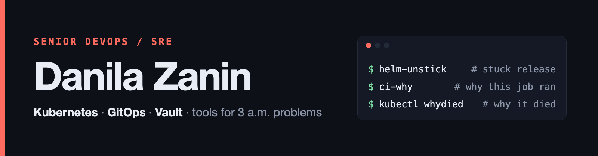

  

  

Senior DevOps engineer. I run hybrid infrastructure: bare-metal Linux and Hyper-V on-prem, AWS for public services, Kubernetes on both (Kubespray and EKS), GitOps with Argo CD and Helm. Terraform for cloud resources, Ansible for the bare-metal fleet.

I also run AI coding agents every day and write about what survives production.

## Tools I wrote for problems I kept running into

<table>
<tr>
<td width="50%" valign="top">

### [helm-unstick](https://github.com/DanilaZanin/helm-unstick)
Recovers a Helm release stuck with "another operation (install/upgrade/rollback) is in progress". Checks that the operation is really dead before it rolls back, and refuses when it cannot tell. Tested end to end on Helm 3 and Helm 4.

`Go` `Helm`

</td>
<td width="50%" valign="top">

### [kubectl-whydied](https://github.com/DanilaZanin/kubectl-whydied)
kubectl plugin that explains why a container or pod died or restarted: the last termination of each container, the mechanism behind it, and the evidence with a confidence label. Checked end to end on kind with 24 failure scenarios.

`Go` `Kubernetes`

</td>
</tr>
<tr>
<td width="50%" valign="top">

### [ci-why](https://github.com/DanilaZanin/ci-why)
Explains which rule added or dropped a GitLab CI job, clause by clause, with the variable values it used. Its answers are compared with a real GitLab on every release.

`Go` `GitLab CI`

</td>
<td width="50%" valign="top">

### [vault-db-access](https://github.com/DanilaZanin/vault-db-access)
Self-service portal for temporary PostgreSQL and ClickHouse credentials on top of HashiCorp Vault's database secrets engine.

`Python` `Vault`

</td>
</tr>
<tr>
<td width="50%" valign="top">

### [argocd-sync-explain](https://github.com/DanilaZanin/argocd-sync-explain)
Read-only explanation of what an Argo CD Application is waiting for, why a sync failed, or why it is out of sync, with the fields each statement comes from. Checked on every release against two Argo CD versions on kind.

`Go` `Argo CD` `Kubernetes`

</td>
<td width="50%" valign="top">

### [runner-disk-report](https://github.com/DanilaZanin/runner-disk-report)
Read-only report of what fills Docker's disk on a GitLab Runner host: cache volumes by project, build containers, images without double-counted layers, build cache. Checked on every release against a real GitLab and a real runner.

`Go` `Docker` `GitLab Runner`

</td>
</tr>
<tr>
<td width="50%" valign="top">

### [vault-map](https://github.com/DanilaZanin/vault-map)
Read-only map of the KV paths a Vault or OpenBao token can list, with its capabilities on each path. It never reads secret payloads; every request is checked against an allowlist and verified against the server's audit log in tests.

`Go` `Vault` `OpenBao`

</td>
<td width="50%" valign="top">

### [devops-starters](https://github.com/DanilaZanin/devops-starters)
Ten copy-paste starters (Ansible, Terraform, Argo CD, Vault, RabbitMQ, Redis, Kafka and others). Each one ships a test that reproduces the production trap it avoids.

`Python` `Terraform` `Ansible`

</td>
</tr>
</table>

## Stack

**Cloud and IaC**&nbsp;&nbsp;   

**Kubernetes and delivery**&nbsp;&nbsp;     

**Data and secrets**&nbsp;&nbsp;  -0d1017?style=flat-square&logo=postgresql&logoColor=ff6b5e)    

**Observability and code**&nbsp;&nbsp;     
